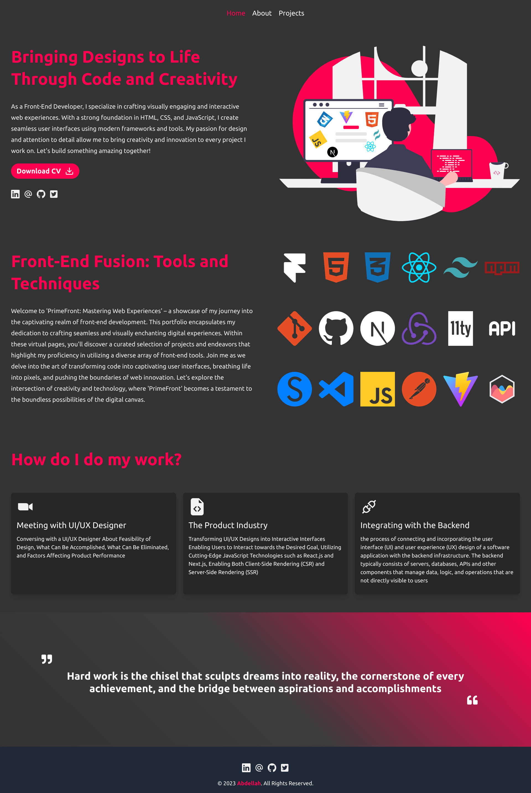
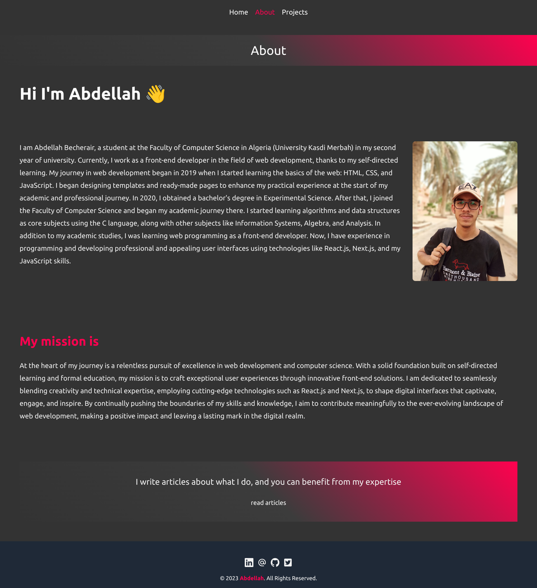

# Abdellah Portfolio
This repository contains the complete codebase and assets for my personal portfolio website. I built this portfolio from the ground up, covering both the user interface (UI) design and implementation. It serves as a showcase of my skills 

## Pages Of Book Store
# Home Page 

# About Page 

## Table of Contents

- [Installation](#installation)
- [Usage](#usage)
- [UI Components](#ui-components)
- [Technologies Used](#technologies-used)
- [Project Structure](#project-structure)
- [Responsive Design](#responsive-design)
- [Challenges and Solutions](#challenges-and-solutions)
- [Contributing](#contributing)
- [License](#license)
- [Contact](#contact)
- [Acknowledgments](#acknowledgments)
- ## Installation
